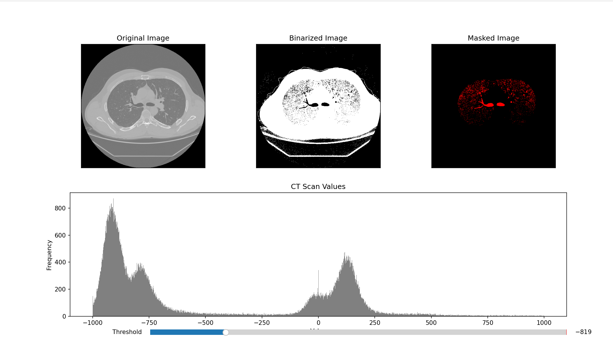
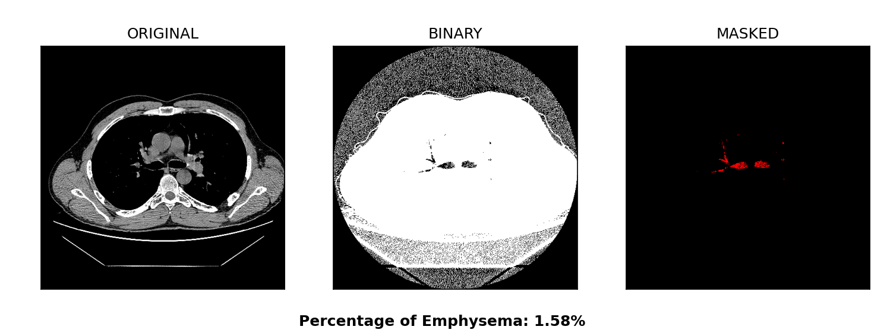

# Lung Segmentation
 Manual Segmentation of lung CT images in python from open-cv, matplotlib, numpy, and pydicom. This was inspired by SciXChange Medical Physics labs which were done in MatLab.

## Instructions
1. Clone the repository
2. Create a virtual environment: `virtualenv venv`.
3. Activate the virtual environment:`venv\Scripts\activate`
4. Download the requirements: `pip install -r requirements.txt`
5. Download and extract `slices.zip` from the database [L. Sorensen](https://lauge-soerensen.github.io/emphysema-database/)
6. Ensure the path is correct when loading the image!
 ## Brief Overview
 The main segmenter is in the `ctimage.py` file, which holds a class that has the functions that creates the masks and other necessary images. 


### ```manualThreshold.py```
An interactable program in matplotlib that will let you determine a threshold. It will display the original ct image, the binary mask, and the processed lung mask which will highlight emphysemic areas (dark areas).



### ```calculateEmphysema.py```
A simple program that will display the thresholded images and percentage of emphysemic areas.



### ```dicom.py``` (WORK IN PROGRESS)
Similar to manualThreshold.py, except it loades in DICOM format images. It is current a WIP as normalization is needed.

# Credits

__For the databases:__

1. [L. Sørensen](https://lauge-soerensen.github.io/emphysema-database/), S. B. Shaker, and M. de Bruijne, Quantitative Analysis of Pulmonary Emphysema using Local Binary Patterns, IEEE Transactions on Medical Imaging 29(2): 559-569, 2010. [[PDF to publication](https://lauge-soerensen.github.io/publications/Sorensen2010.pdf)]

2. [VIA-ELCAP Public Access](https://www.via.cornell.edu/databases/lungdb.html)